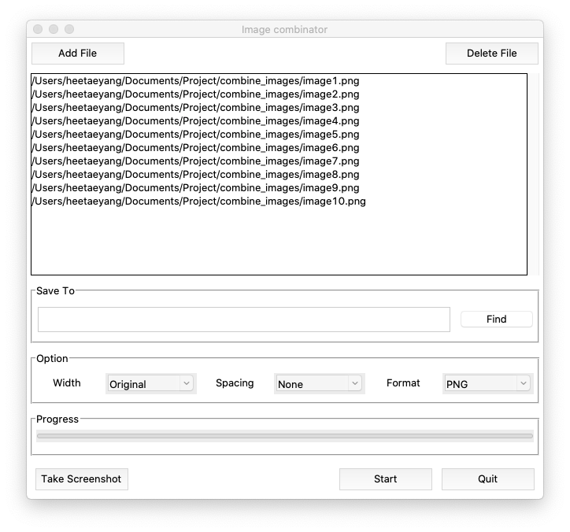
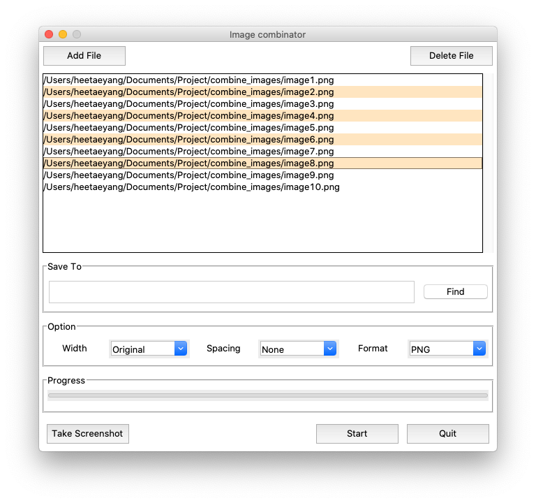
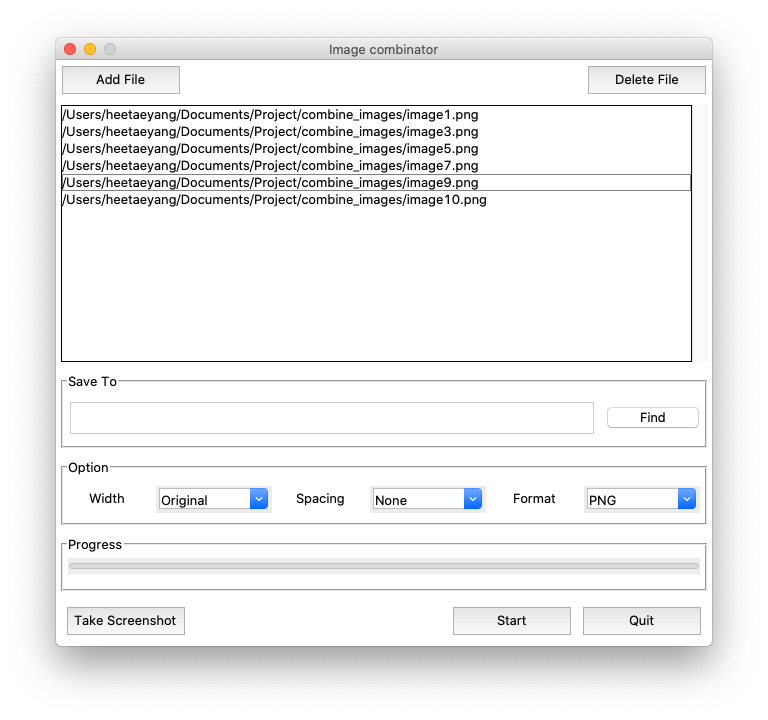
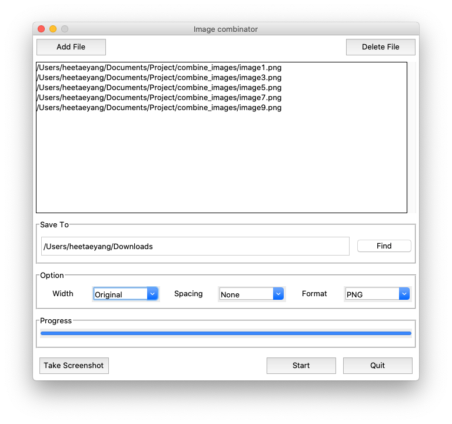

# Image Combinator

There are times when we get to capture different pictures/scence from videos. 
As the number of captured files become larger, it becomes hassle to reorganize and upload them in a right order.
This program helps you to add multiple image files and combine them with different options; including the file format selection, resize image, 
and add spacing between combined images for better display.

## Functions
Image Combinator gives users following options to choose:
###### Widths
    - Original, 1024, 800, and 640

###### Spacing
    - None(0), Narrow(10), Normal(30), and Wide(60)
 
###### Format
    - PNG, JPG, and BMP

###### Screenshot
    - Experimental feature
    - User can quickly take a screenshot of the screen
    - Currently set with 10 pictures with 2 seconds of delays between.
    - When process ends, it will show the alert.

## How to Use
- Use 'Add File' button to add images

- Use 'Delete File' button to remove images from the list

- Select wanted options, select save to path and press 'Start'

## Output
